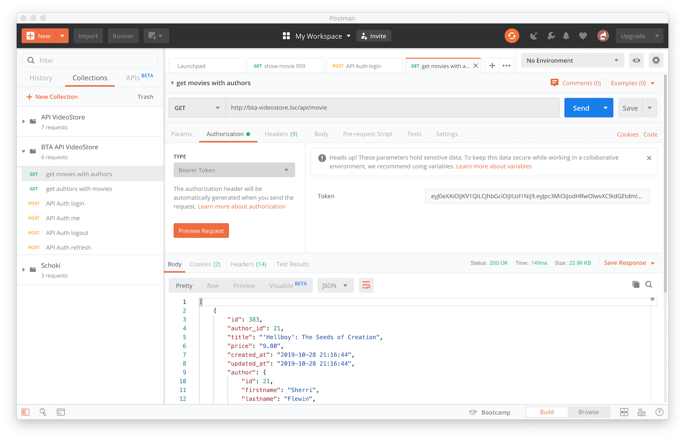

## bta-laravel-videostore

nach dem clonen von Github folgendes per Terminal im Projektverzeichnis ausführen:

- erstelle eine MySQL Datenbank namens 'videostore' und importiere darin die SQL-Datei aus database/dump.
- (linux, macosx) setup
- (windows) setup.bat

#### oder folgendes einzeln nacheinander:
- composer install
- npm install
- (für lokalen Gebrauch) .htaccess anlegen mit RedirectPermanent Anweisung:
 Verzeichnis im Webroot => VHost Adresse
 (zB: **RedirectPermanent /bta-videostore http://bta-videostore.loc**) 
- npm run dev
- .env.local kopieren nach .env und die darin enthaltenen Conf-Daten anpassen

#### Für Windows DNS in host Datei eintragen (C:\Window\System32\drivers\etc\host)
- 127.0.0.1 bta-videostore.loc
- 127.0.0.1 admin.bta-videostore.loc
- 127.0.0.1 monitor.bta-videostore.loc

#### Apache -> httpd-vhosts.conf
```
<VirtualHost *:80>
	ServerName bta-videostore.loc
	ServerAlias *.bta-videostore.loc
        DocumentRoot PATH TO ... /bta-laravel-videostore/public
	CustomLog PATH TO apache logfiles .../access_bta_videostore.log "%h %l %u %t \"%r\" %>s %b Referer: \"%{Referer}i\""
	ErrorLog PATH TO apache logfiles .../error_bta_videostore.log
</VirtualHost>
```

#### Für API-Requests nutzen wir JWT (JSON Web Token)
Dafür installieren wir tymon/jwt-auth von https://github.com/tymondesigns/jwt-auth.
Da es bereits in der composer.json eingetragen ist, erfolgt die installation bereits über ```composer install```
Für die dafür notwendigen Projektanpassungen und Konfigurationen siehe bitte in die Dokumentation:
https://jwt-auth.readthedocs.io/en/develop

#### Zum Testen der API-Requests kannst Du Googles Postman nutzen
https://www.getpostman.com/

Wenn installiert, dann kannst Du hier die zu testenden Requests anlegen und ausführen:

